# Quizetime!

Quiztime is an easy-to-use quiz site, both for the user and if you want to create a quiz with a specific topic or for a particular demographic. 
The quiz displays a question and four different answer options. When the user selects an answer, it clearly shows if it is the right or wrong answer. When the user has completed all the questions, the total score will display in the question area. But if the user wants to keep track of every point, they can see them at the bottom of the page.
If you want to adjust the questions, you can easily do so in a separate JavaScript file. That way, you don’t need to be afraid to change something you shouldn’t.

[Link to Quiztime](https://lindaapersson.github.io/Portfolio-2/)

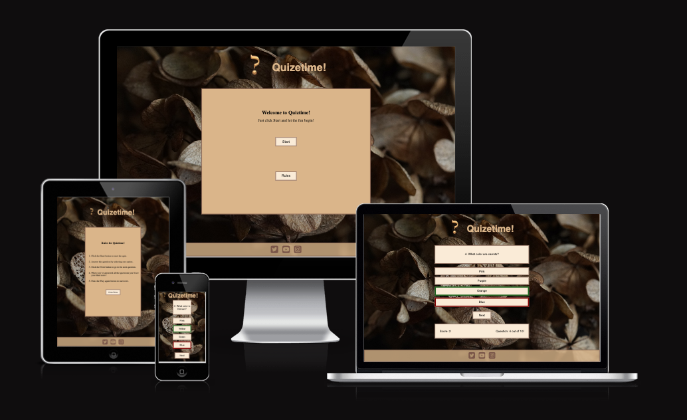

## Site structure
The site consists of one single page that displays a header, footer, 'starting box,' 'rules box,' and a 'game area'. The 'starting box' and 'rules box' hide when the game starts, and the 'game area' changes when the user has completed all the questions.

To help me map out all the functions and how I wanted the quiz to work, I took the help of LucidFlowchart. This image helps me see what I needed to start with and what I was supposed to do next. For example, it was while doing this chart that I decided not to include an 'exit button' because I want the user to keep answering questions and staying on the site. Especially if you change the questions to some harder ones, I don’t want the user to take the 'easy way out' by just pressing an exit button; I want them to go all the way and answer everything.

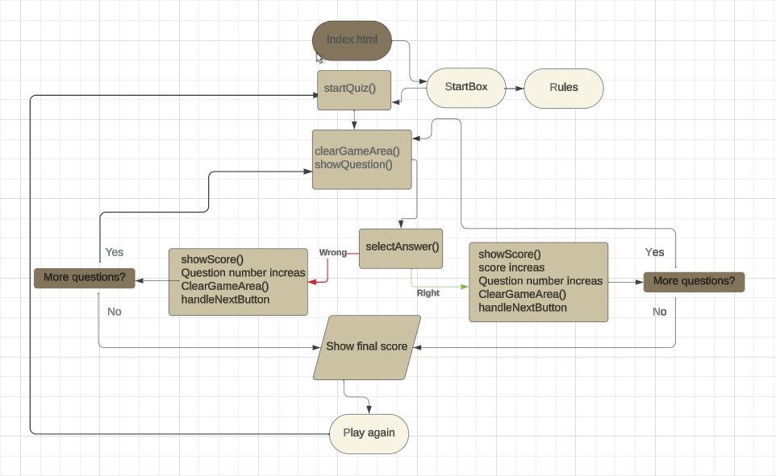

## Design
I knew that I wouldn’t have the time to come up with the most original or specific questions, so I focused on making the quiz easy to use and change. So you can use the quiz and adapt it to whatever occasion you want! With that in mind, I made the following options:

### Font
I chose the font Poppins because it's easy to read but with a little twist. It works for all ages and gives a good contrast that is easy to read.

### Background
The background is just one single image. This makes it very easy to change the background to something that matches the questions.

### Colors
The main colors are beige, brown, and black. I chose those colors because they give a good contrast that makes it easy to read the text. And that is a very important thing while using an online quiz

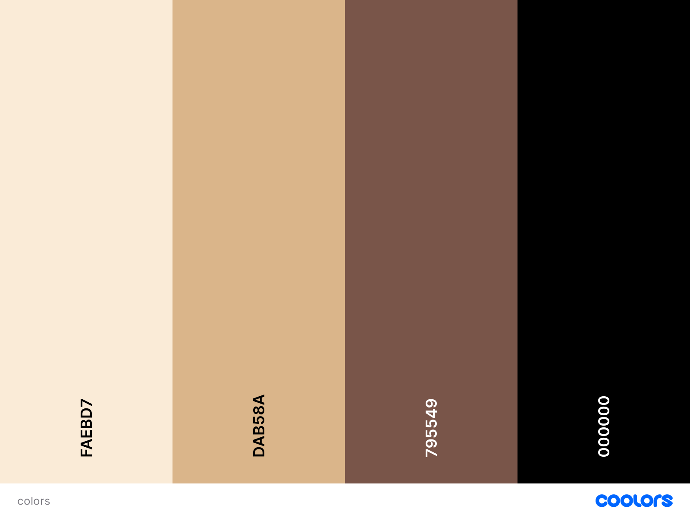

## Features
Quiztime is a responsive and interactive site with the following features:

### The Header
The header contains an image of a question mark and the logo. It clearly shows the user the name of the page.

### The footer
The footer displays at the bottom of the page and contains three social media icons (Twitter, YouTube, and Instagram). All icons are clickable and take the user to each social media platform in a new tab.

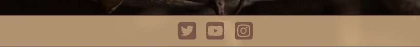

### The “starting box”  
This is what the user will see when they enter the page. It greets them and gives the two options. They can either choose the Start button to start the game or the Rules button to read the rules of the game.

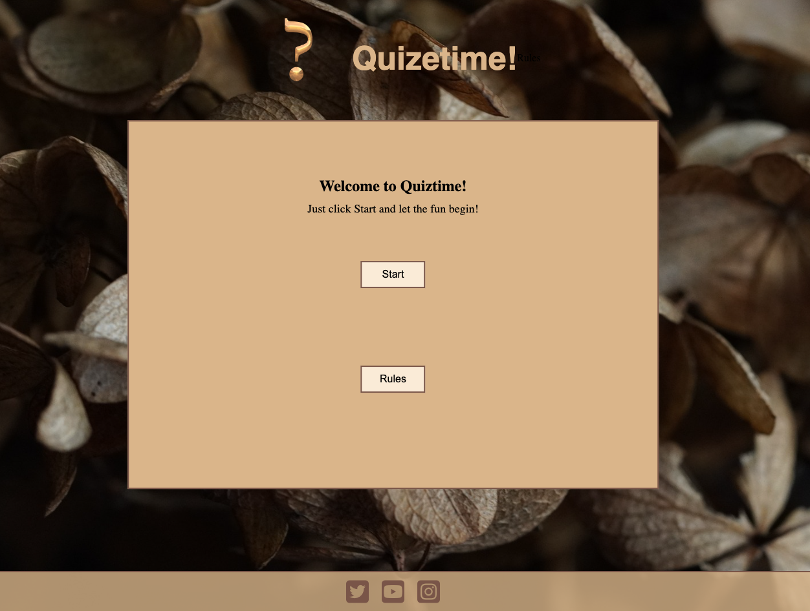

### The “rules box”
Since Quiztime is designed to be easy to use and just gives the user one or two clickable options, the rules section is more of a 'how to play' section. When the user clicks the rules button, it takes them to an area that displays instructions on what they need to do to get through the quiz.

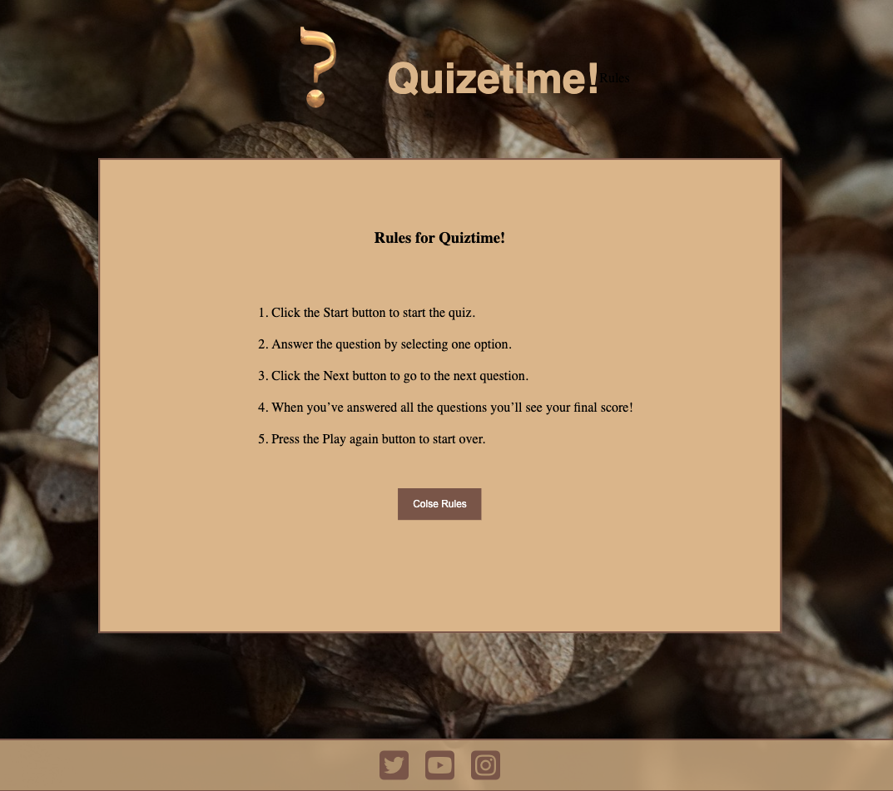

### The Quiz
After clicking the Start button, the user will enter the quiz. The page displays a questions area, where the user can read the question, four answer options, a Next button, and an area where the user can see their score, what question they are on, and how many they have left. 

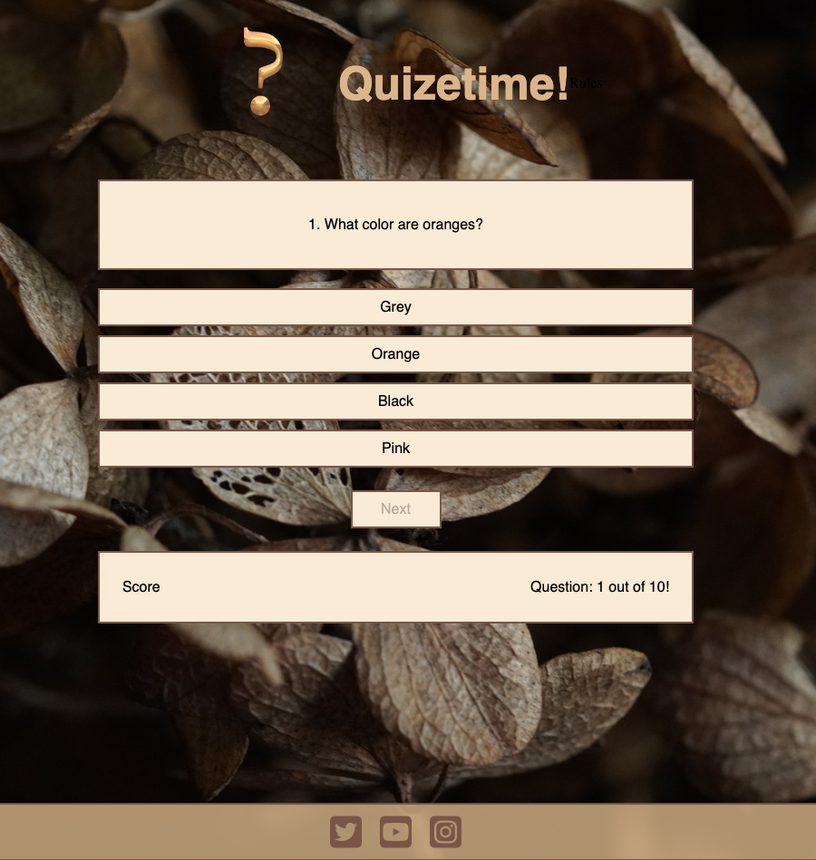

#### Question area
The question area is at the top of the page with the question clearly displayed along with the question number.

#### Answer Options
There are four buttons that display the different answer options. The user can only click on one of the options at this point. The Next button is disabled. If the user selects the right option, the border of that option will become green. If the user selects the wrong answer, the border of that option will become red, and the border on the right answer will become green.

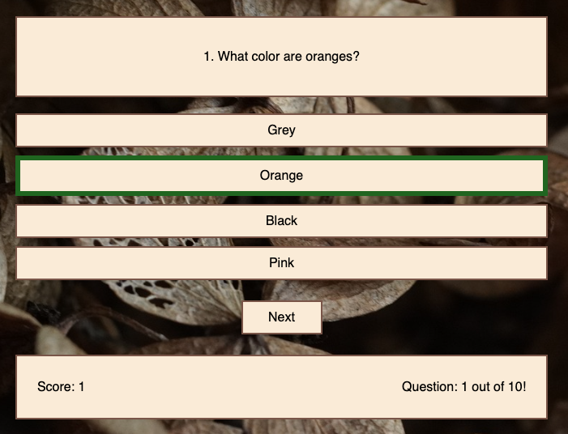
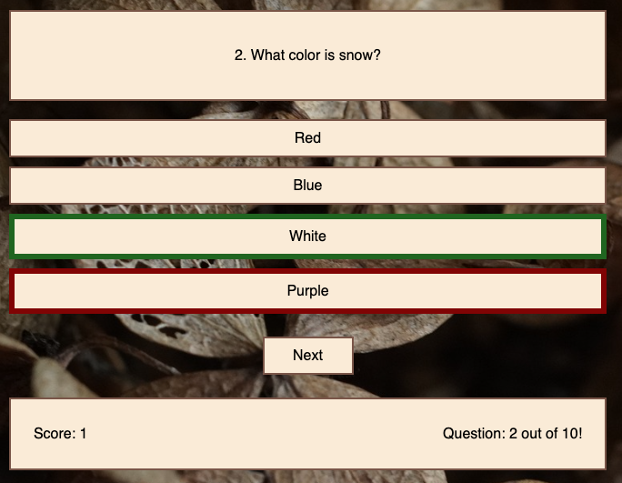

#### Next button
After the user has selected an option, the Next button will be clickable again, and it will take the user to the next question.

#### Score Area
The area underneath the Next button displays the user's score, what question the user is on and how many questions they have left.

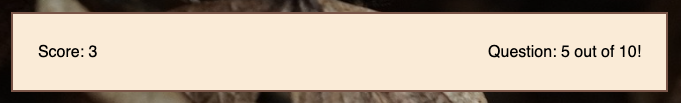

### JavaScript
There are two separate JavaScript files connected to Quiztime, one with the functions and descriptions on how the quiz should run, and one with all the questions. The purpose of that arrangement is to make it as easy as possible to change the questions and answers.

## Deployment 
The site was deployed early in the project using GitHub. To deploy the site, I took the following steps:  
1. Log into GitHub.
2. Locate the right GitHub Repository.
3. At the top of the repository, select Settings from the menu.
4. Scroll down the Settings page to the "Pages" section.
5. Under "Source" click the drop-down menu labeled "None" and select "Main".
6. When selected, the page will automatically refresh and the website is deployed.
7. Scroll back down to the "Pages" section to get the link to the webpage.

## Testing
- The site sizes down to 320px and is responsive up to 1920px.
- Entering the page, the 'starting box' appears as expected, and the two buttons are clickable. 
- The 'rules box' works as expected, and the Close Rules button is clickable and takes you back to the starting box. 
- The quiz displays questions as expected, and the question number increases with every question. 
- The questions display in a random order. 
- When the answer options are shown, the Next button is disabled. 
- The answer changes color depending on whether the right or wrong answer was selected. 
- The score increases when the user selects the right answer. 
- The final score is displayed in the question area when the user has completed all the questions. 
- The Next button changes its name to 'Play Again' when the user has answered all the questions.

### HTML
The HTML code was tested with W3C Validation, with no errors. 

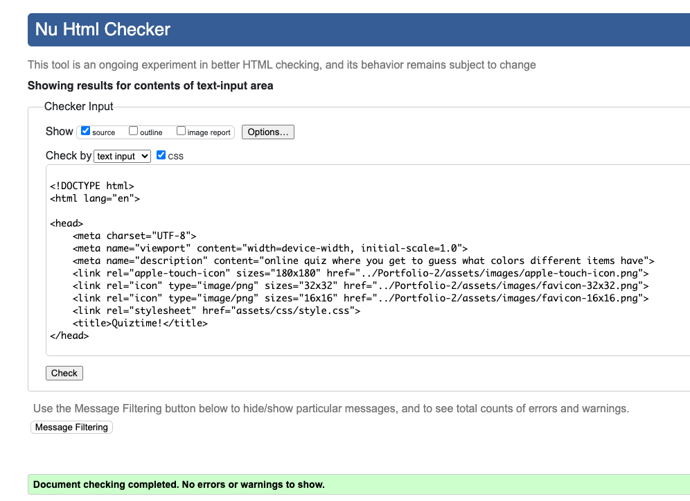

### CSS
The CSS cod was tested with W3 Jigsaw, with no errors.

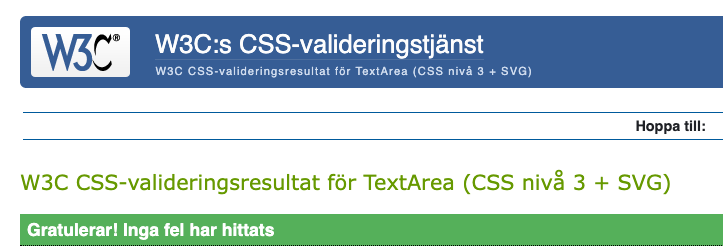

### Lighthouse
Testing the page with Lighthouse, desktop view, it got a good result. 

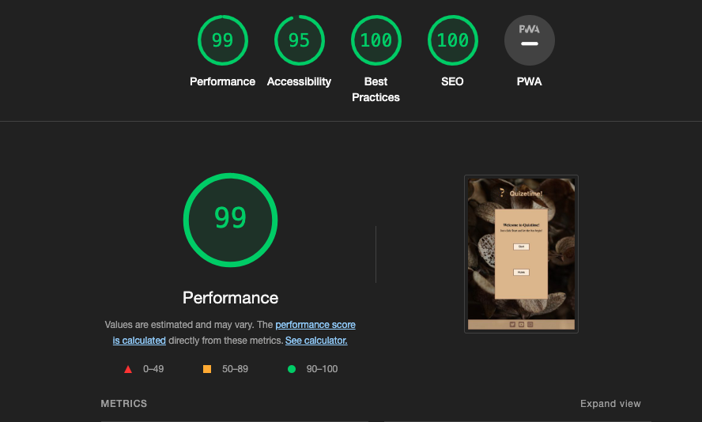

Testing the page with Lighthouse, mobile view, it got a score that has room for improvement. Reading the report, it says that the LCP needs to improve. Unfortunately, I don’t have the knowledge to do something about that.

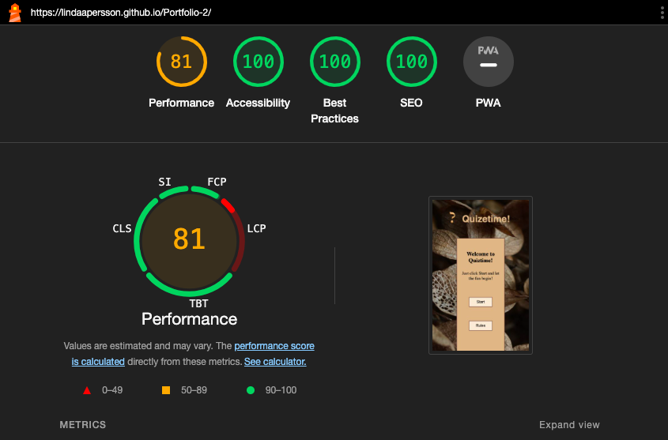

### JavaScript
The two JavaScript files were tested with JSHint and came back with good results but with a warning of one undefined variable/one unused variable. That is because there are two separate JavaScript files.

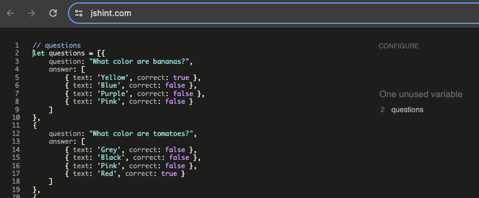

## Buggs
### Debugging
While testing the page, my mentor found a bug. After answering the first question and got to the second question, and she could click the Next button without selecting an answer. So she could skip to the end without answering nine questions.

### Fix
I fixed that by moving “hide next button” to the right place in the file: script.js. 

### Unfixed buggs
There is no unfixed bugs at the page right now, that I’m aware of. 

## Credits

### Code
- The code for the Faveicon are from [Faveicon generator](https://realfavicongenerator.net/)
- This YouTube tutorial gave me inspiration and ideas on how I wanted Quiztime to turn out. [Youtube Tutorial](https://www.youtube.com/watch?v=riDzcEQbX6k)

### Media
- The two images used are royalty free from Prixabay. You can find them here: 
[Logo, questionmark](https://pixabay.com/sv/illustrations/fr%C3%A5getecken-alfabet-fr%C3%A5gande-font-3246711/)
[Background image](https://pixabay.com/sv/photos/l%C3%B6v-v%C3%A4xt-torr-falla-hortensia-8390274/) 
- The Faveicon images was created through this site: [Faveicon](https://realfavicongenerator.net/)
- The flowchart was created with Lucidchart: [Lucischart](https://lucid.app/documents#/documents?folder_id=recent)
- The social media symbols are from Fontawsome: [Fontawsome](https://fontawesome.com/)
- The font was imported fron GoogleFonts [Google Fonts](https://fonts.google.com/)
- Color pallet generated with Coolors [Coolors generator](https://coolors.co/)
